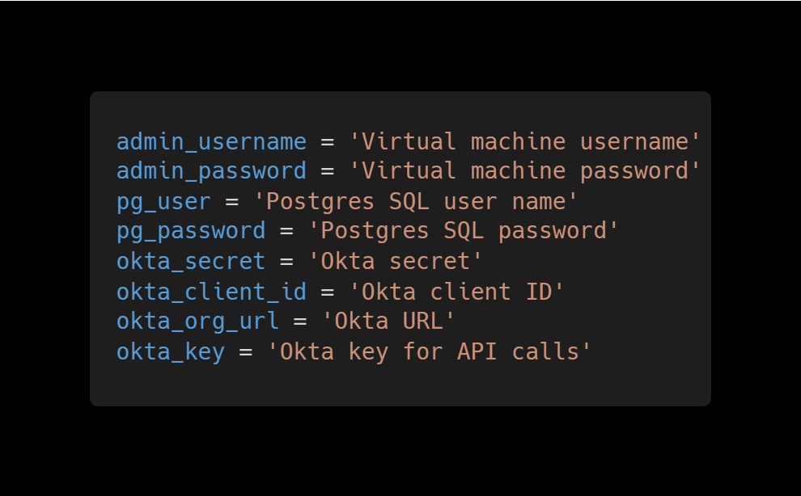

# Description

in this template we are building an Elastic High Availability
virtual network on azure with terraform code.
on that infrastructure we are going to deploy a Node.js Weight Trackerr App.

**an explanation on the way the app is deploied and it's dependacies can be found in this link** [Node.js Weight Tracker](https://github.com/odedrafi/bootcamp-app).

---

## Notes

In this project we will demostrate an elastic high avalibility network on azure cloud provisined with terraform.

As part of a DevOps bootcamp is sela accademy [Sela DevOps Bootcamp Page](https://rhinops.io/bootcamp).

It includes:

- a module that deploys a linux virtual machine scale set with auto scailing
- a load balancer to handle the traffic
- a use of a config script to load up the app on the web servers
- a fully automated code for a plug and play setup of infrastructure and app.
- An azure postgrers flexible data server

---

## Deployment

first you need to install terraform and connect to azure provider as explained in
[Install Terraform - HashiCorp Learn](https://learn.hashicorp.com/tutorials/terraform/install-cli).

